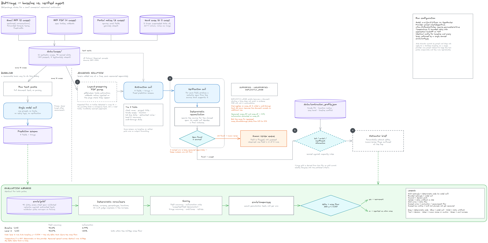

# BidTriage

An agent that ingests inbound project requests for small commercial mechanical
contractors, extracts structured bid data, verifies every field against the
source document, and produces a go/no-go triage decision plus an
estimator-ready brief.

Entry for the **micro1 Frontier Engineering Challenge 2026**.

---

## The user and the bottleneck

**Who.** The sole operations coordinator at a small commercial mechanical
contractor (HVAC/plumbing). The firm runs five or six overlapping projects a
year. She is the only person who touches inbound work before it reaches an
estimator.

**What arrives.** Emails with the scope buried in prose. RFP PDFs with spec
tables and addenda. Bid-portal notifications that are little more than a link
and a due date.

**What she does today.** Reads each one manually. Re-keys client, project
title, trade scope, location, bid due date, estimated value, bonding and
insurance requirements, and walk-through date into a spreadsheet. Then decides
whether it is worth the estimator's time at all.

**The cost.** Each intake takes 20–40 minutes. The errors are the expensive
part: a missed addendum that moves a bid date, a quantity read out of the wrong
column, an alternate priced as base scope. Any one of them loses a bid
opportunity outright — and the firm only gets five or six shots a year.

**Why an agent, specifically.** This is not a parsing problem. Getting a date
out of a PDF is easy. The hard part is knowing *which* date is controlling when
the cover sheet, four page footers, and page 4's addendum disagree — and being
willing to say "I am not sure, look at this one" instead of guessing. That is
judgment under uncertainty over messy documents, which is what an agent is for
and what a regex is not.

## What "good" means (defined before measuring)

Frozen in [`docs/scoring-rules.md`](docs/scoring-rules.md), committed **before**
any result existed. Git history is the proof: that file predates every file in
`evals/results/`.

| Metric | Target |
|---|---|
| Field-level extraction accuracy (primary) | ≥ 90% |
| Hallucination rate (asserted-field denominator) | ≤ 2% |
| Estimator brief | forwardable without edits |

Scoring is fully deterministic — no LLM judge anywhere in the harness.

## Eval set

12 synthetic cases, **96 scored slots** (8 required fields × 12 cases).

| Format | Cases | Notes |
|---|---|---|
| Email RFP requests | 01–05 | varying verbosity: sectioned, conversational, forwarded thread with quoted history, terse, fixed-width tabular |
| RFP PDFs | 06–09 | generated with realistic spec-table layouts |
| Bid-portal notifications | 10, 11 | terse and link-style; most fields genuinely absent |
| Hard case | 12 | see below |

**88 slots are present in source; 8 are legitimately absent.** Absence is a
first-class gold value: for the portal cases the correct output is `null`, and
asserting a value there is what the hallucination metric counts.

**Case 12** is the deliberately hard one. Three traps, each a real intake
failure mode:

1. The superseded bid date appears **five times** (cover sheet plus every page
   footer); the controlling Addendum No. 2 date appears **once**, on page 4.
2. Fire-protection work sits in an `ALT 1` column with a base-bid quantity of
   zero. Reading it as base scope pulls in a trade the contractor does not
   self-perform — which flips the triage decision.
3. The engineer's estimate is a range, not a point value.

Case 12 is **layout-degraded, not a true scan.** A real scan would need an OCR
system dependency (tesseract) that would break clean-environment
reproducibility, so the structural failure modes are reproduced without it.
This is a deliberate, disclosed deviation from "scanned-looking."

Triage gold is **derived** from [`data/contractor_profile.json`](data/contractor_profile.json)
rather than hand-asserted, so it cannot silently disagree with the published
criteria. The mix is 6 bid / 4 no-bid / 2 insufficient-information, and each
no-bid is driven by a **different** failing criterion, so all four triage rules
are exercised.

### Data integrity

- **Everything is synthetic.** "Summit Peak Mechanical", every client, every
  person, and every document are fictional. All email domains use the reserved
  `.example` TLD (RFC 6761). Colorado place names are real geography used for
  realism; they identify no person or organization.
- **Drive distances are declared operating parameters,** not geocoded
  measurements, and are labelled as such in the profile. They exist to make
  triage deterministic and auditable.
- **Every gold citation is verified.** `evals/author_gold.py` asserts that each
  non-null `source_span` appears verbatim (whitespace-normalized) in the
  extracted source text. A span that cannot be located is a hard failure, not a
  warning. Gold citations therefore cannot be things that merely seemed to be in
  the document.

## System design

Baseline and solution run over the same 12 cases and are scored by the same
harness, so the comparison is like-for-like. Source:
[`docs/system-design.excalidraw`](docs/system-design.excalidraw) (open at
[excalidraw.com](https://excalidraw.com)).

## Status

| Step | State |
|---|---|
| 0 — Repo setup | done |
| 1 — Synthetic eval set + gold keys | done |
| 2 — Baseline | **done, measured over 4 runs** |
| 3 — Eval harness | done |
| 4 — Solution levers | not started |

## Baseline results (measured, n = 4 runs)

Every figure below comes from a run recorded in `evals/results/`. Nothing is
estimated. Cost is the amount OpenRouter actually charged, read from the
response usage block.

| Metric | Target | Baseline (mean of 4) | Range | Meets target? |
|---|---|---|---|---|
| Field accuracy | ≥ 90% | **95.05%** | 93.75 – 95.83 | **yes** |
| Hallucination (asserted denom.) | ≤ 2% | **3.16%** | 2.30 – 4.60 | **no** |
| Triage decision accuracy | — | **91.67%** | identical all 4 runs | — |
| Cost per case | — | **$0.00013** | — | — |
| Hard failures | — | **0** | 5–6 retries/run on upstream 429s | — |

Two findings worth stating plainly:

**The baseline already clears the field-accuracy bar.** The ≥90% target, frozen
before measurement, is met by a single untooled call. The primary metric has
very little headroom. The bar it *misses* is hallucination, so that — and triage
— is where the real work is.

**Temperature 0 is not deterministic here.** Re-running the identical config
spreads results by 2.08 percentage points (2 slots, sd 0.86). Any lever delta
below roughly 2pp is indistinguishable from noise at n=1, so every comparison
uses n=3 minimum. Separating stable from flaky failures across the 4 runs gives
four **systematic** failures — the only honest lever targets:

| Slot | Failure |
|---|---|
| `case_02.estimated_project_value` | misses a conversationally phrased budget ("Budget we're working with is $310,000") |
| `case_04.project_title` | appends the bid-package code; scored strictly, documented as harsh |
| `case_08.bond_insurance` | returns null instead of positively asserting "no bonding required" |
| `case_10.trade_scope` | asserts "Mechanical" where the correct answer is abstention — this is the hallucination |

Notably, the baseline **passed both headline traps in case 12**: it found the
Addendum No. 2 date rather than the five copies of the superseded one, and kept
fire protection out of the base scope.

## Tools disclosure

| Tool | Used for |
|---|---|
| Claude Code (Opus 5) | all development in this repo, driven interactively |
| **OpenRouter API** | the agent itself (baseline and solution). The only external service the agent calls. |
| **`z-ai/glm-5.3-flash`** | the model under test, via OpenRouter |
| Python 3.12 via `uv` | pinned runtime, exact versions in `requirements.txt` |
| `reportlab` | generating the synthetic RFP PDFs |
| `pdfplumber` | PDF text extraction |
| `gh` CLI | repo creation |

The agent client is stdlib `urllib` — no vendor SDK, no vector database, no
orchestration framework. Nine pinned packages total.

### Model and routing

| | |
|---|---|
| Model | `z-ai/glm-5.3-flash` (fallback `z-ai/glm-5.2` if structured output proves unreliable; any switch is logged in `CHANGELOG.md`) |
| Routing | `provider.only=["deepinfra"]`, `allow_fallbacks=false`, `require_parameters=true` |
| Auto Exacto | not applicable — provider is pinned |
| Temperature | 0 |

Routing is pinned to a single provider so the baseline and every lever run on
identical infrastructure. **Auto Exacto cannot be pinned**: OpenRouter's docs
state it runs by default on every tool-calling request and is opt-out, and it
applies only to requests that include tools — so it would never have applied to
the toolless baseline. Measured live, an unpinned toolless call routed to Z.AI
(no structured-output support) while an unpinned tool call routed to Together at
double the price. Pinning removes that confound. Full reasoning in
`evals/config.py` and `CHANGELOG.md`; the client verifies the resolved provider
against the pin on every call rather than assuming it.

## What pre-existed vs. what was built during the event

**Pre-existed:** nothing. The repository was initialized empty at the start of
the event — see the initial commit.

**Built during the event:** all of it. The eval corpus and its generators, the
gold answer keys and their validator, the scoring rules, the contractor
capacity model, the baseline, the harness, and the solution.

The only carried-in assets are general knowledge of how commercial mechanical
bidding works (bid bonds, spec sections, alternates, addenda) and standard
open-source libraries, both listed above.

## Traces

`traces/` holds Claude Code session transcripts showing tool calls, tool
responses, retries, and human checkpoints.

Transcripts are copied by [`scripts/capture_traces.py`](scripts/capture_traces.py),
which requires session ids to be named explicitly and has **no copy-all flag by
design**: the Claude Code project directory on the development machine also
holds unrelated sessions, and `traces/` is public. Every transcript is passed
through a credential-shaped-string redactor first; what was replaced is recorded
in [`traces/REDACTIONS.md`](traces/REDACTIONS.md) so redaction is auditable
rather than silent.

## Reproducing

See [`REPRODUCE.md`](REPRODUCE.md). Commands are added there only after they
have actually been run.
