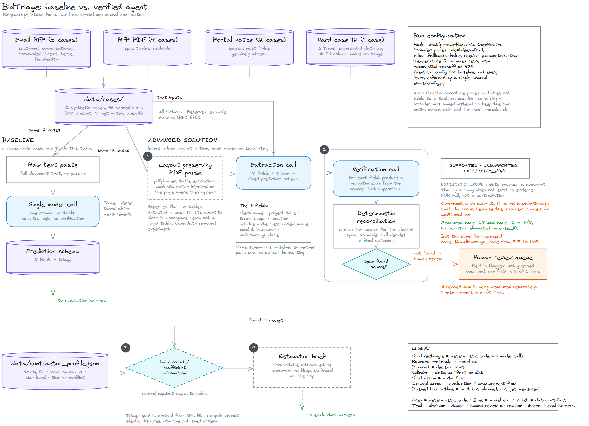
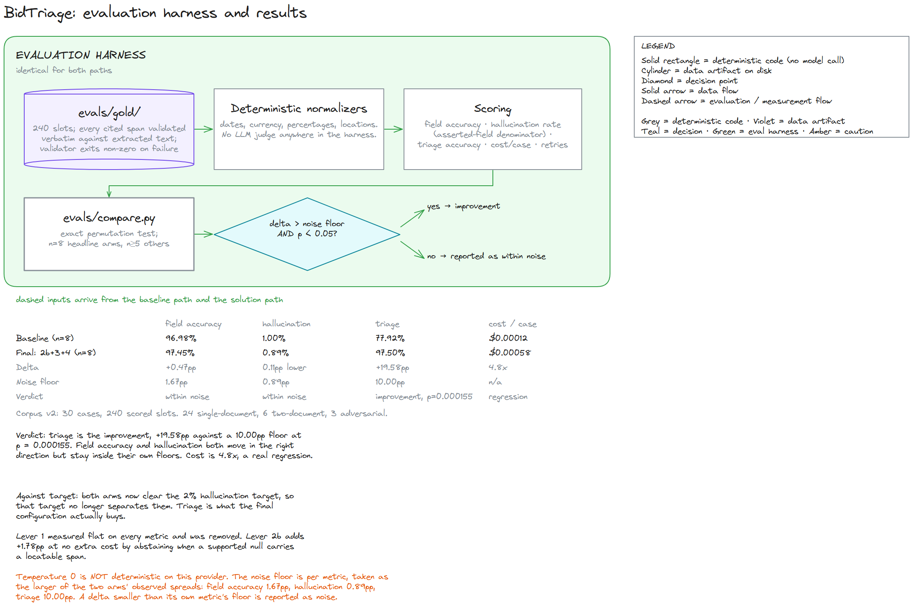

# BidTriage

An agent that ingests inbound project requests for small commercial mechanical
contractors, extracts structured bid data, verifies every field against the
source document, and produces a go/no-go triage decision plus an
estimator-ready brief.

Entry for the **micro1 Frontier Engineering Challenge 2026**.

---

## The user and the bottleneck

**Who.** The sole operations coordinator at a small commercial mechanical
contractor (HVAC/plumbing). The firm runs five or six overlapping projects a
year. She is the only person who touches inbound work before it reaches an
estimator.

**What arrives.** Emails with the scope buried in prose. RFP PDFs with spec
tables and addenda. Bid-portal notifications that are little more than a link
and a due date.

**What she does today.** Reads each one manually. Re-keys client, project
title, trade scope, location, bid due date, estimated value, bonding and
insurance requirements, and walk-through date into a spreadsheet. Then decides
whether it is worth the estimator's time at all.

**The cost.** Each intake takes 20 to 40 minutes. The errors are the expensive
part: a missed addendum that moves a bid date, a quantity read out of the wrong
column, an alternate priced as base scope. Any one of them loses a bid
opportunity outright, and the firm only gets five or six shots a year.

**Why an agent, specifically.** This is not a parsing problem. Getting a date
out of a PDF is easy. The hard part is knowing *which* date is controlling when
the cover sheet, four page footers, and page 4's addendum disagree, and being
willing to say "I am not sure, look at this one" instead of guessing. That is
judgment under uncertainty over messy documents, which is what an agent is for
and what a regex is not.

## What "good" means (defined before measuring)

Frozen in [`docs/scoring-rules.md`](docs/scoring-rules.md), committed **before**
any result existed. Git history is the proof: that file predates every file in
`evals/results/`.

| Metric | Target |
|---|---|
| Field-level extraction accuracy (primary) | at least 90% |
| Hallucination rate (asserted-field denominator) | at most 2% |
| Estimator brief | forwardable without edits |

Scoring is fully deterministic. There is no LLM judge anywhere in the harness.

## Eval set

12 synthetic cases, **96 scored slots** (8 required fields by 12 cases).

| Format | Cases | Notes |
|---|---|---|
| Email RFP requests | 01 to 05 | varying verbosity: sectioned, conversational, forwarded thread with quoted history, terse, fixed-width tabular |
| RFP PDFs | 06 to 09 | generated with realistic spec-table layouts |
| Bid-portal notifications | 10, 11 | terse and link-style; most fields genuinely absent |
| Hard case | 12 | see below |

**88 slots are present in source; 8 are legitimately absent.** Absence is a
first-class gold value: for the portal cases the correct output is `null`, and
asserting a value there is what the hallucination metric counts.

**Case 12** is the deliberately hard one. Three traps, each a real intake
failure mode:

1. The superseded bid date appears **five times** (cover sheet plus every page
   footer); the controlling Addendum No. 2 date appears **once**, on page 4.
2. Fire-protection work sits in an `ALT 1` column with a base-bid quantity of
   zero. Reading it as base scope pulls in a trade the contractor does not
   self-perform, which flips the triage decision.
3. The engineer's estimate is a range, not a point value.

Case 12 is **layout-degraded, not a true scan.** A real scan would need an OCR
system dependency (tesseract) that would break clean-environment
reproducibility, so the structural failure modes are reproduced without it.
This is a deliberate, disclosed deviation from "scanned-looking."

Triage gold is **derived** from [`data/contractor_profile.json`](data/contractor_profile.json)
rather than hand-asserted, so it cannot silently disagree with the published
criteria. The mix is 6 bid, 4 no-bid, and 2 insufficient-information, and each
no-bid is driven by a **different** failing criterion, so all four triage rules
are exercised.

### Corpus provenance

The corpus is entirely synthetic, but its shape is not invented. The document
structures, the commercial terms (bonding percentages and liability limits), and
the triage criteria follow documented industry practice rather than assumption.
A corpus whose conventions were guessed would measure how well a model handles
those guesses. See [`docs/corpus-v2-design.md`](docs/corpus-v2-design.md) for
what was sourced, with citations, and for what is deliberately **not** sourced.

Source quality is graded there rather than flattened. Platform invitation
structure and bonding conventions are well documented, from BuildingConnected's
own documentation and FAR Part 28 respectively. The decline-reason criteria are
partly peer-reviewed (project size, capital, payment timeliness, workload,
overhead) and partly vendor-derived: the frequently quoted figure that 80% of
accepted bids fall within 55 miles comes from a vendor toolkit with no published
methodology, so it is treated as directional rather than as a constant.

### Data integrity

- **Everything is synthetic.** "Summit Peak Mechanical", every client, every
  person, and every document are fictional. All email domains use the reserved
  `.example` TLD (RFC 6761). Colorado place names are real geography used for
  realism; they identify no person or organization.
- **Drive distances are declared operating parameters,** not geocoded
  measurements, and are labelled as such in the profile. They exist to make
  triage deterministic and auditable.
- **Every gold citation is verified.** `evals/author_gold.py` asserts that each
  non-null `source_span` appears verbatim (whitespace-normalized) in the
  extracted source text. A span that cannot be located is a hard failure, not a
  warning. Gold citations therefore cannot be things that merely seemed to be in
  the document.

## Status

| Step | State |
|---|---|
| 0. Repo setup | done |
| 1. Synthetic eval set and gold keys | done |
| 2. Baseline | done, measured over 8 runs |
| 3. Eval harness | done |
| 4. Solution levers | levers 2 and 3 measured at n=8; lever 4 built, wiring in progress; lever 1 built but unmeasured |

## System design and measured results

*Inputs and the two paths.* Source:
[`docs/system-design-paths.excalidraw`](docs/system-design-paths.excalidraw)

*Evaluation harness and results.* Source:
[`docs/system-design-evaluation.excalidraw`](docs/system-design-evaluation.excalidraw)

> Both diagrams open at [excalidraw.com](https://excalidraw.com) from the
> sources above. Every figure in the second diagram is also written out as a
> table below, so the numbers stay readable however the image scales.

**What the pipeline does.** Twelve synthetic cases, four input shapes (email
RFPs, RFP PDFs, sparse portal notices, and one deliberately hard PDF), feed two
paths. The **baseline** pastes the raw document text into a single model call
with no tools, no retry logic, and no verification. The **solution** runs an
extraction call, then a verification call, then a triage call, adding one lever
at a time. Both paths emit the same fixed prediction schema and are scored by
the same harness over the same 96 slots, so the comparison is like-for-like and
neither path can win on output formatting.

**How verification works (lever 2).** A second pass re-reads the source and
returns, for every field, a status and a quote it claims supports that value.
Reconciliation then searches the actual document for that quote: a model
asserting it checked is worth nothing, but a quote that must be found
character-for-character is a checkable claim. A field whose claimed span cannot
be located drops to a human review queue instead of being believed, and the
whole reconciliation is deterministic, so no model call decides a final outcome.

**How triage works (lever 3).** The contractor capacity rules are rendered into
criteria the model can check: self-performed trades, a declared drive-distance
table, the size band, and the three already-committed projects with a
three-project concurrency limit. The model evaluates each criterion and says
why; code applies only the published boolean formula to the model's own answers.
The gold generator's computation is deliberately not ported into the solution,
because scoring it against itself would prove nothing.

### Results, n = 8 runs per arm

Levels first. Every figure comes from a run recorded in `evals/results/`.
Nothing is estimated, and cost is the amount OpenRouter actually charged.

| Metric | Target | Baseline | Lever 2 | Lever 2+3 |
|---|---|---|---|---|
| Field accuracy | at least 90% | 95.31% | 96.74% | 96.88% |
| Hallucination (asserted denom.) | at most 2% | 2.87% | 1.88% | 2.02% |
| Triage decision accuracy | n/a | 90.62% | 89.58% | **100.00%** |
| Cost per case | n/a | $0.00013 | $0.00040 | $0.00060 |
| Hard failures | n/a | 0 | 0 | 0 |

Verdicts against the baseline, under the rule enforced in
[`evals/compare.py`](evals/compare.py):

| Metric | Delta | Noise floor | p | Verdict |
|---|---|---|---|---|
| Field accuracy | 1.56pp higher | 2.08 | 0.003 | within noise |
| Hallucination | 0.86pp lower | 2.30 | 0.061 | within noise |
| Triage accuracy | **9.38pp higher** | 8.33 | 0.000 | **improvement** |
| Cost per case | 4.6x higher | n/a | 0.000 | **regression** |

Lever 3's own incremental contribution, measured against lever 2 rather than
against the baseline, so it is not credited with lever 2's work:

| Metric | Lever 2 | Lever 2+3 | Delta | p | Verdict |
|---|---|---|---|---|---|
| Triage accuracy | 89.58% | **100.00%** | 10.42pp higher | 0.000 | **improvement** |
| Field accuracy | 96.74% | 96.88% | 0.13pp | 1.000 | within noise |
| Hallucination | 1.88% | 2.02% | 0.14pp higher | 0.840 | within noise |
| Cost per case | $0.00040 | $0.00060 | 1.5x higher | 0.000 | regression |

**Lever 3 is the first lever to clear the bar.** Triage reaches 100.00% on every
one of the 8 runs, with zero variance, against a baseline that sat at 90.62%
with an 8.33 point spread. It leaves field accuracy and hallucination untouched,
which is what lever isolation should look like: it was built to fix triage and
it moved triage.

That result was checked for the obvious way it could be hollow. Lever 3 splits
the work so the model evaluates the four capacity criteria and code applies only
the published boolean formula. If the formula were carrying the score, the
result would prove nothing. Across all 96 case-decisions the model's own
decision agreed with the rule **96 out of 96 times**, and the rule corrected the
model on **zero** occasions. The formula contributed nothing to the number. On
case_06, the systematic timeline-conflict failure that neither the baseline nor
lever 2 ever gets right, the model derived the at-capacity window itself in 8
runs out of 8:

> "All three committed projects run concurrently from 2026-10-01 (Foothills
> start) to 2026-12-10 (Clear Creek end), which is the maximum of 3. The new
> window (2026-11-01 to 2027-02-28) overlaps that period."

That window matches what `derive_triage()` computes, and it was reached without
being given it.

**Lever 2 is still not reported as an improvement.** Its two headline deltas
remain smaller than the run-to-run spread even though the permutation test now
puts both at p below 0.05. The rule requires a delta to clear the spread, and it
is applied as written rather than relaxed once the numbers became suggestive.
One statement about levels rather than deltas, which the rule does not cover:
lever 2's mean hallucination of 1.88% is under the 2% target and the baseline's
2.87% is not, at 3 of 8 runs versus 0 of 8.

### Lever verdicts

| Lever | State | Verdict |
|---|---|---|
| 1. Document parsing | built (`solution/parse.py`), not yet measured | pending. Expected flat: pdfplumber finds tables in cases 06 to 09, which already score near-perfectly, and **zero** tables in case 12, whose quantity block is monospace text. It is measured anyway rather than assumed. |
| 2. Verification with span checking | measured, n=8 per arm | **not an improvement.** Both headline deltas are smaller than the run-to-run spread. The only statistically solid result is that it costs 3.1 times more. A revision to fix the case 12 regression is pending separate measurement. |
| 3. Structured triage | measured, n=8 per arm | **improvement, and the only one so far.** Triage 89.58% to 100.00%, zero variance across 8 runs, p=0.000, clearing the 8.33 noise floor. Verified model-driven: the model agreed with the boolean rule on 96 of 96 decisions and the rule corrected it zero times. |
| 4. Estimator brief | built (`solution/brief.py`), wiring in progress | no measurable effect on the field metrics by construction, since it renders already-verified fields and makes no model call. Judged on whether it is forwardable without edits. |

### Two findings that shape the project

**The baseline already clears the field-accuracy bar.** The 90% target, frozen
before measurement, is met by a single untooled call. The primary metric has
very little headroom. The bar it *misses* is hallucination, so that and triage
are where the real work is.

**Temperature 0 is not deterministic here.** Re-running the identical config
spreads field accuracy by 2.08 percentage points (2 slots, sd 0.86). Any lever
delta below roughly 2pp is indistinguishable from noise at n=1. Comparisons
therefore use n=8 per arm. Triage is noisier still: it held at 91.67% across
the first five baseline runs, but a sixth returned 83.33%, so the earlier claim
that baseline triage had zero variance did not survive the larger sample.

### What lever 2 changed

Across 752 field verifications: 90.4% were kept with a span found verbatim in
the source, 6.4% abstained because the source was silent, 2.8% abstained
because the source explicitly said the thing does not exist, and 0.4% were
flagged as supported but null.

| Slot | Baseline | Lever 2 | Effect |
|---|---|---|---|
| `case_08.bond_insurance` | 8/8 failed | 0/8 | fixed |
| `case_10.trade_scope` (the hallucination) | 8/8 failed | 0/8 | fixed |
| `case_02.estimated_project_value` | 7/8 failed | 5/8 | improved |
| `case_02.bond_insurance` | 1/8 failed | 0/8 | fixed |
| `case_06.trade_scope` | 1/8 failed | 0/8 | fixed |
| `case_04.project_title` | 8/8 failed | 8/8 | unchanged |
| `case_05.project_title` | 3/8 failed | 5/8 | **worse** |
| `case_12.walkthrough_date` | 0/8 failed | 7/8 | **introduced** |

The `EXPLICITLY_NONE` status added to fix case 08 is over-applied. Addendum 2.2
of case 12 says the walk-through "held September 30, 2026 is not rescheduled.
No additional walk-through will be held." The verifier reads the second
sentence and nulls the field, but the walk-through did happen, on the date gold
records. The fix that gained one point systematically costs another. That is
most of why the accuracy gain stays inside the noise band, and it is being
addressed as a separately measured revision rather than folded in silently.

`case_04.project_title` fails in every run of both arms: the model appends the
bid-package code to the title. It is scored strictly and documented as harsh
rather than quietly softened.

The human-review path fired on one field in three of eight runs
(`case_02.estimated_project_value`). It is a real checkpoint and it appears in
the traces, but it is rarer than the design implies.

Notably, the baseline **passed both headline traps in case 12**: it found the
Addendum No. 2 date rather than the five copies of the superseded one, and kept
fire protection out of the base scope.

## Tools disclosure

| Tool | Used for |
|---|---|
| Claude Code (Opus 5) | all development in this repo, driven interactively |
| **OpenRouter API** | the agent itself (baseline and solution). The only external service the agent calls. |
| **`z-ai/glm-5.3-flash`** | the model under test, via OpenRouter |
| Python 3.12 via `uv` | pinned runtime, exact versions in `requirements.txt` |
| `reportlab` | generating the synthetic RFP PDFs |
| `pdfplumber` | PDF text extraction |
| `gh` CLI | repo creation |

The agent client is stdlib `urllib`. There is no vendor SDK, no vector database,
and no orchestration framework. Nine pinned packages total.

### Model and routing

| | |
|---|---|
| Model | `z-ai/glm-5.3-flash` (fallback `z-ai/glm-5.2` if structured output proves unreliable; any switch is logged in `CHANGELOG.md`) |
| Routing | `provider.only=["deepinfra"]`, `allow_fallbacks=false`, `require_parameters=true` |
| Auto Exacto | not applicable, because the provider is pinned |
| Temperature | 0 |

Routing is pinned to a single provider so the baseline and every lever run on
identical infrastructure. **Auto Exacto cannot be pinned**: OpenRouter's docs
state it runs by default on every tool-calling request and is opt-out, and it
applies only to requests that include tools, so it would never have applied to
the toolless baseline. Measured live, an unpinned toolless call routed to Z.AI
(no structured-output support) while an unpinned tool call routed to Together at
double the price. Pinning removes that confound. Full reasoning in
`evals/config.py` and `CHANGELOG.md`. The client verifies the resolved provider
against the pin on every call rather than assuming it.

## What pre-existed vs. what was built during the event

**Pre-existed:** nothing. The repository was initialized empty at the start of
the event. See the initial commit.

**Built during the event:** all of it. The eval corpus and its generators, the
gold answer keys and their validator, the scoring rules, the contractor
capacity model, the baseline, the harness, and the solution.

The only carried-in assets are general knowledge of how commercial mechanical
bidding works (bid bonds, spec sections, alternates, addenda) and standard
open-source libraries, both listed above.

## Traces

`traces/` holds the complete Claude Code session transcripts as raw JSONL.
Those are the authoritative record and are kept unmodified.

**[`traces/annotated/`](traces/annotated/) is a readable subset of those same
transcripts**, not a replacement for them and not a separate record. The raw
JSONL is roughly 5 MB of session events, which no reader can realistically
follow from an instruction through to a result, so four episodes are extracted
and annotated:

| Episode | What it shows |
|---|---|
| [Human checkpoint: freezing the scoring rules](traces/annotated/01-human-checkpoint-scoring-rules.md) | The agent stops and asks before any number exists, then folds in four mid-turn refinements |
| [An instruction overridden by measurement](traces/annotated/02-instruction-overridden-by-measurement.md) | An instruction that could not be followed, checked rather than obeyed, with a live 429 retry visible |
| [The loop catching its own error](traces/annotated/03-the-loop-catching-its-own-error.md) | A self-test failing and catching a defect that would have failed every location field |
| [Lever 3 verified, not assumed](traces/annotated/04-lever-3-verified-not-assumed.md) | A 100% result, then the agent testing whether its own rule was carrying the score |

Nothing in an episode is paraphrased. Everything outside a clearly marked
annotation is verbatim, long tool inputs and outputs are truncated with the
omitted character count shown, and where events are skipped inside an episode
the exact number omitted is printed. The bug episode is included deliberately:
a trajectory set showing only successes would misrepresent how the work went.

Episodes are regenerated from the raw transcript with
`python scripts/build_trace_episodes.py`, so they cannot drift from it.

Transcripts are copied by [`scripts/capture_traces.py`](scripts/capture_traces.py),
which requires session ids to be named explicitly and has **no copy-all flag by
design**: the Claude Code project directory on the development machine also
holds unrelated sessions, and `traces/` is public. Every transcript is passed
through a credential-shaped-string redactor first; what was replaced is recorded
in [`traces/REDACTIONS.md`](traces/REDACTIONS.md) so redaction is auditable
rather than silent.

## Reproducing

See [`REPRODUCE.md`](REPRODUCE.md). Commands are added there only after they
have actually been run.
